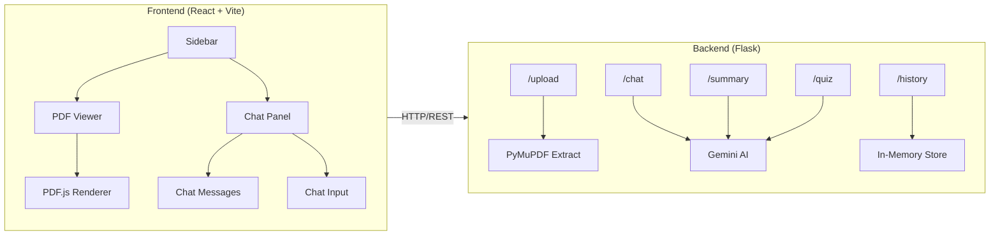

# AskMyPDF AI — Implementation Plan

A premium AI-powered PDF chatbot web application where users upload PDFs, view them inline, and chat with an AI assistant that answers questions, summarizes content, and generates quizzes from document context.

## User Review Required

> [!IMPORTANT]
> **AI API Key**: The backend needs an API key for AI responses. Which do you prefer?
> - **Google Gemini API** (free tier available — recommended for hackathon)
> - **OpenAI API** (GPT-3.5/GPT-4)
> 
> I'll default to **Gemini API** (`google-generativeai` Python SDK) unless you say otherwise. You'll set your key in a `.env` file.

> [!NOTE]
> The app will store PDFs and conversation history **in-memory + local filesystem** (no database). This keeps setup simple for a hackathon. Conversations persist only while the server is running.

## Open Questions

1. Do you have a Gemini API key ready, or should I include instructions on getting one?
2. Any specific font preference, or should I use **Inter** from Google Fonts?

---

## Architecture Overview



**Data Flow:**
1. User uploads PDF → Flask saves file, extracts text with PyMuPDF, chunks it
2. User asks question → Flask sends document chunks + question to Gemini → returns answer
3. Chat history is maintained per conversation in server memory

---

## Project Structure

```
d:\B Vcoding\Mypdf\
│
├── frontend/
│   ├── index.html
│   ├── package.json
│   ├── vite.config.js
│   ├── tailwind.config.js
│   ├── postcss.config.js
│   ├── public/
│   │   └── favicon.svg
│   └── src/
│       ├── main.jsx
│       ├── App.jsx
│       ├── index.css
│       ├── api/
│       │   └── api.js                 # Axios/fetch wrappers for all endpoints
│       ├── components/
│       │   ├── Sidebar/
│       │   │   ├── Sidebar.jsx
│       │   │   ├── IconBar.jsx
│       │   │   ├── ConversationList.jsx
│       │   │   └── ConversationCard.jsx
│       │   ├── PDFViewer/
│       │   │   ├── PDFViewer.jsx
│       │   │   └── PDFControls.jsx
│       │   ├── Chat/
│       │   │   ├── ChatPanel.jsx
│       │   │   ├── ChatMessage.jsx
│       │   │   ├── ChatInput.jsx
│       │   │   └── TypingIndicator.jsx
│       │   ├── Header/
│       │   │   └── Header.jsx
│       │   └── common/
│       │       ├── Modal.jsx
│       │       └── Loader.jsx
│       ├── hooks/
│       │   └── useChat.js             # Custom hook for chat state management
│       ├── context/
│       │   └── AppContext.jsx          # Global state (conversations, active PDF, etc.)
│       └── utils/
│           └── helpers.js
│
├── backend/
│   ├── app.py                         # Flask app entry point
│   ├── requirements.txt
│   ├── .env.example
│   ├── config.py                      # Configuration / env loading
│   ├── routes/
│   │   ├── __init__.py
│   │   ├── upload.py                  # /upload endpoint
│   │   ├── chat.py                    # /chat endpoint
│   │   ├── summary.py                 # /summary endpoint
│   │   ├── quiz.py                    # /quiz endpoint
│   │   └── history.py                 # /history endpoint
│   ├── services/
│   │   ├── __init__.py
│   │   ├── pdf_service.py             # PDF extraction + chunking
│   │   └── ai_service.py              # Gemini API integration
│   ├── store/
│   │   ├── __init__.py
│   │   └── memory_store.py            # In-memory conversation + document store
│   └── uploads/                       # Directory for uploaded PDFs
│
└── README.md
```

---

## Proposed Changes

### Backend — Flask API

#### [NEW] [app.py](file:///d:/B%20Vcoding/Mypdf/backend/app.py)
- Flask app factory with CORS enabled
- Register all route blueprints
- Serve uploaded files statically
- Run on port 5000

#### [NEW] [config.py](file:///d:/B%20Vcoding/Mypdf/backend/config.py)
- Load `.env` with `python-dotenv`
- Export `GEMINI_API_KEY`, `UPLOAD_FOLDER`, `MAX_FILE_SIZE`

#### [NEW] [requirements.txt](file:///d:/B%20Vcoding/Mypdf/backend/requirements.txt)
```
flask
flask-cors
PyMuPDF
google-generativeai
python-dotenv
```

---

#### [NEW] [routes/upload.py](file:///d:/B%20Vcoding/Mypdf/backend/routes/upload.py)
- `POST /upload` — Accept PDF file, save to `uploads/`, extract text, chunk, store in memory, return `{ doc_id, filename, page_count }`

#### [NEW] [routes/chat.py](file:///d:/B%20Vcoding/Mypdf/backend/routes/chat.py)
- `POST /chat` — Accept `{ doc_id, conversation_id, message }`, find relevant chunks, send to Gemini with context, return `{ answer, sources: [{ page, text }] }`

#### [NEW] [routes/summary.py](file:///d:/B%20Vcoding/Mypdf/backend/routes/summary.py)
- `POST /summary` — Accept `{ doc_id }`, generate a concise summary using Gemini

#### [NEW] [routes/quiz.py](file:///d:/B%20Vcoding/Mypdf/backend/routes/quiz.py)
- `POST /quiz` — Accept `{ doc_id, num_questions }`, generate MCQs in structured JSON

#### [NEW] [routes/history.py](file:///d:/B%20Vcoding/Mypdf/backend/routes/history.py)
- `GET /history` — Return all conversation metadata
- `GET /history/<conversation_id>` — Return full chat history for a conversation
- `DELETE /history/<conversation_id>` — Delete a conversation

---

#### [NEW] [services/pdf_service.py](file:///d:/B%20Vcoding/Mypdf/backend/services/pdf_service.py)
- `extract_text(filepath)` → list of `{ page: int, text: str }`
- `chunk_text(pages, chunk_size=1000, overlap=200)` → list of `{ chunk_id, page, text }`
- Uses PyMuPDF (`fitz`) for extraction

#### [NEW] [services/ai_service.py](file:///d:/B%20Vcoding/Mypdf/backend/services/ai_service.py)
- `ask_question(question, context_chunks)` → answer string + source references
- `summarize(full_text)` → summary string
- `generate_quiz(full_text, num_questions)` → list of MCQ objects
- Uses `google.generativeai` with `gemini-1.5-flash` model
- System prompts engineered to prevent hallucination and cite sources

#### [NEW] [store/memory_store.py](file:///d:/B%20Vcoding/Mypdf/backend/store/memory_store.py)
- `documents: dict` — `{ doc_id: { filename, filepath, pages, chunks } }`
- `conversations: dict` — `{ conv_id: { doc_id, title, messages: [], created_at } }`
- Helper methods: `add_document()`, `get_document()`, `create_conversation()`, `add_message()`, `get_history()`

---

### Frontend — React + Vite + Tailwind

#### [NEW] [package.json](file:///d:/B%20Vcoding/Mypdf/frontend/package.json)
Key dependencies:
- `react`, `react-dom`
- `react-pdf` (PDF.js wrapper for rendering)
- `framer-motion`
- `lucide-react`
- `axios`
- `tailwindcss`, `postcss`, `autoprefixer`

#### [NEW] [index.css](file:///d:/B%20Vcoding/Mypdf/frontend/src/index.css)
- Tailwind directives
- Custom CSS variables for the color palette:
  - `--bg-dark: #1a1a2e` (sidebar)
  - `--bg-main: #ffffff` (PDF area)
  - `--bg-chat: #f8f8f8` (chat area)
  - `--accent: #f5c542` (yellow accents)
  - `--text-primary: #1a1a2e`
  - `--text-secondary: #6b7280`
- Scrollbar styling
- Custom animation keyframes

---

#### [NEW] [App.jsx](file:///d:/B%20Vcoding/Mypdf/frontend/src/App.jsx)
- Three-column responsive layout: `Sidebar | PDFViewer | ChatPanel`
- Wraps everything in `AppProvider` context
- Handles mobile sidebar toggle

#### [NEW] [context/AppContext.jsx](file:///d:/B%20Vcoding/Mypdf/frontend/src/context/AppContext.jsx)
Global state managed via React Context + useReducer:
- `conversations[]` — list of all conversations
- `activeConversation` — currently selected conversation
- `activeDocument` — currently loaded PDF info
- `pdfFile` — uploaded file URL for viewer
- `messages[]` — chat messages for active conversation
- `isLoading` — loading states

#### [NEW] [api/api.js](file:///d:/B%20Vcoding/Mypdf/frontend/src/api/api.js)
- `uploadPDF(file)` → POST to `/upload`
- `sendMessage(docId, convId, message)` → POST to `/chat`
- `getSummary(docId)` → POST to `/summary`
- `getQuiz(docId)` → POST to `/quiz`
- `getHistory()` → GET `/history`
- `getConversation(convId)` → GET `/history/{convId}`
- Base URL configurable via env var

---

#### UI Components

##### [NEW] Sidebar (`components/Sidebar/`)
- **IconBar.jsx**: Narrow dark strip with logo + icon buttons (chat, upload, tools, settings, profile, logout)
- **ConversationList.jsx**: Search bar + "New Conversation" button + grouped history (Today / Yesterday)
- **ConversationCard.jsx**: Individual conversation item with hover highlight, active state, 3-dot menu
- Collapsible on mobile via hamburger icon

##### [NEW] PDFViewer (`components/PDFViewer/`)
- **PDFViewer.jsx**: Uses `react-pdf` to render PDF pages
  - Page navigation (prev/next)
  - Zoom in/out controls
  - Page counter ("Page X of Y")
  - Action buttons bar: Explain, Summarise, Rewrite
- **PDFControls.jsx**: Bottom toolbar with zoom + page nav + text select

##### [NEW] ChatPanel (`components/Chat/`)
- **ChatPanel.jsx**: Container with scrollable message area + input at bottom
- **ChatMessage.jsx**: Styled bubble — AI (left, light bg, with avatar) / User (right, dark/yellow bg)
  - Timestamp display
  - Source page references
  - Framer Motion entrance animation
- **ChatInput.jsx**: Rounded input field with send button icon, placeholder text
- **TypingIndicator.jsx**: Animated 3-dot typing indicator shown while AI responds

##### [NEW] Header (`components/Header/`)
- **Header.jsx**: Top bar showing current document name, "View Doc" link, model badges (decorative)

##### [NEW] Common (`components/common/`)
- **Modal.jsx**: Reusable modal for quiz display, upload dialog
- **Loader.jsx**: Pulsing/spinning loader for loading states

---

### Styling & Design Details

Matching the reference image closely:

| Element | Style |
|---------|-------|
| Icon sidebar | `w-16`, dark bg `#1a1a2e`, centered icons, yellow active indicator |
| Conversation panel | `w-64`, `#0d0d1a` bg, white text, rounded cards |
| PDF viewer | White bg, slight shadow, centered content |
| Chat panel | `#f8f8f8` bg, rounded message bubbles |
| AI message | Light gray bubble, left-aligned, small AI avatar |
| User message | Dark/charcoal bubble, right-aligned |
| Action buttons | White bg, rounded-full, subtle border |
| Yellow accents | `#f5c542` for active states, send button, highlights |
| Font | Inter (Google Fonts) |

---

## Verification Plan

### Automated Tests
1. Start Flask backend → verify all 5 endpoints respond correctly with `curl`/Postman
2. Start Vite dev server → verify UI renders with all three panels
3. Upload a sample PDF → verify it displays in the viewer
4. Send a chat message → verify AI response appears with animation
5. Test Summarize and Quiz buttons
6. Test conversation history persistence

### Manual Verification
1. Visual comparison with reference image
2. Mobile responsiveness check (resize browser)
3. Smooth animations and transitions
4. Error states (no PDF uploaded, API key missing, network error)

---

## Setup Instructions (will be in README.md)

### Backend
```bash
cd backend
python -m venv venv
venv\Scripts\activate        # Windows
pip install -r requirements.txt
# Create .env with GEMINI_API_KEY=your_key_here
python app.py
```

### Frontend
```bash
cd frontend
npm install
npm run dev
```

App runs at `http://localhost:5173` (frontend) with API at `http://localhost:5000` (backend).
